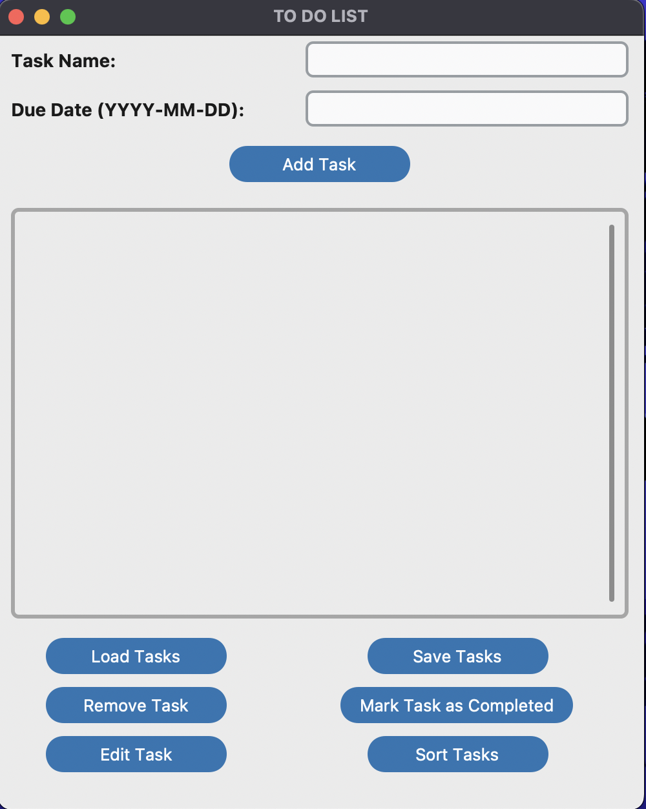

# TO-DO LIST
A simple To-Do List built using Python's CustomTkinter, allowing users to efficiently create and manage tasks. This application allows users to stay on top of their priorities by enabling them to add, save, edit, sort, load, mark task as completed and remove tasks.

## Table Of Contents:
* [About The Program](#about-the-program)
* [Requirements](#requirements)
* [Setup](#setup)
* [Program Output](#program-output)
* [Reference](#reference)

## About The Program

**Add Tasks**:
The program prompts the user to input a task name and its due date. The user can then add the task to the list by clicking the `Add Task` button.

**Save Tasks**:
The user can save tasks by clicking the `Save Tasks` button, which creates an external .txt file where the tasks are stored.

**Edit Tasks**:
Users can edit tasks in the list by clicking the `Edit Task` button, allowing them to change the task name and update the due date.

**Sort Tasks**:
The program allows users to sort tasks in by name or due date by clicking the `Sort Tasks` button.

**Load Tasks**:
By clicking the `Load Tasks` button, users can load and view previously saved tasks from the external .txt file in the list.

**Mark Tasks as Completed**:
When a task is completed, users can mark it as finished by clicking the `Mark Task as Completed` button.

**Remove Tasks**:
Once a task is marked as completed or no longer needed, the user can remove it from the list by clicking the `Remove Task` button.

## Requirements
- Python
- Tkinter
- CustomTkinter
- CTkListbox

## Setup
To run this program, use the following commands in your terminal:

```
$ cd To-Do-List
$ python3 main.py
```

## Program Output


## Reference
* [Python Documentation - Tkinter](https://docs.python.org/3/library/tkinter.html)
* [CustomTkinter Documentation](https://customtkinter.tomschimansky.com/documentation/)
